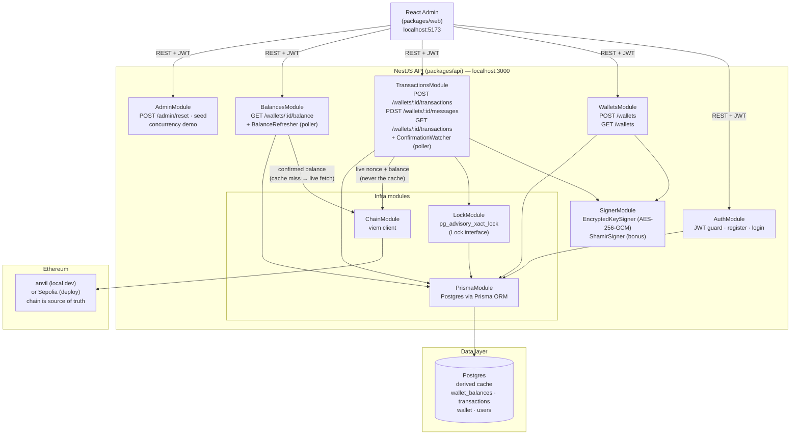
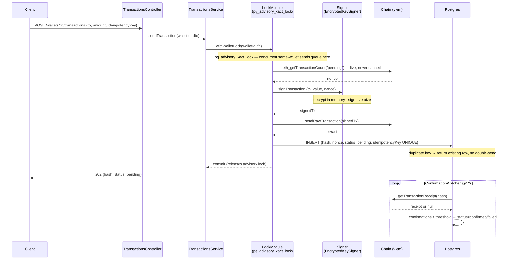
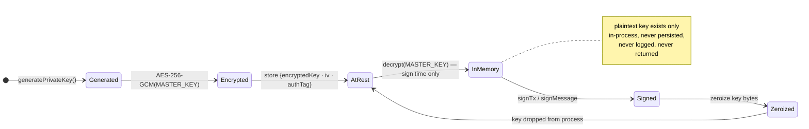

# VenCura — Architecture

How the system is wired and how the two correctness-critical paths (a send under concurrency, and key
custody) actually work. For *where* it runs see [DEPLOYMENT.md](DEPLOYMENT.md); for the threat model see
[SECURITY.md](SECURITY.md).

**Core principle:** the chain is the source of truth; Postgres is a derived, cached projection. Sends validate
against live chain state (nonce + balance), never the cache.

## System architecture

## sendTransaction — sequence with nonce lock

## Key custody — AES-256-GCM at rest

