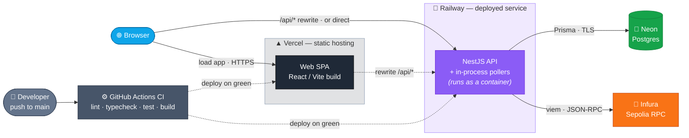

# VenCura — Deployment

Four managed hosts, each doing one job. The browser loads the SPA from **Vercel**; Vercel rewrites `/api/*` to
the **Railway** API (also reachable directly). The API is the only thing that talks to **Neon** (Postgres) and
the chain RPC (**Infura**/Sepolia). Pushes to `main` run CI, then Vercel and Railway each auto-deploy their package.

## Topology

## Hosts

| Host | Runs | Notes |
| --- | --- | --- |
| **Vercel** | `packages/web` static SPA | `/api/*` rewrite → Railway (see [`vercel.json`](../vercel.json)) |
| **Railway** | `packages/api` — deployed service | NestJS + in-process pollers, run as a container; reachable directly at its `*.up.railway.app` URL |
| **Neon** | Postgres | reached via Prisma over TLS (`DATABASE_URL`) |
| **Infura** | Sepolia JSON-RPC | reached via viem (`RPC_URL`) |

The API URL is tied to the Railway **service**, not the project — renaming the project doesn't break it.

## Deploy-time config

Set these in each host's env (they're documented in [`.env.example`](../.env.example)):

- `RPC_URL` — your Infura/Alchemy Sepolia URL (not the local anvil default)
- `CONFIRMATIONS` — `3`–`12` on a public network for reorg safety
- `MASTER_ENCRYPTION_KEY` / `JWT_SECRET` / `ADMIN_API_KEY` — generate with `openssl rand -hex 32`

Secrets come from the environment and are never committed — only `.env.example` (placeholders) is tracked.

## GitHub Environments (auto-created)

The Vercel and Railway GitHub integrations create deployment environments automatically — they aren't defined
in this repo:

- **`Production`** — created by `vercel[bot]`. Vercel hardcodes this name; not configurable.
- **`<project> / production`** — created by `railway-app[bot]`. The first segment is the Railway **project
  name**; rename the project in Railway's dashboard to change it (GitHub recreates the env on next deploy).
